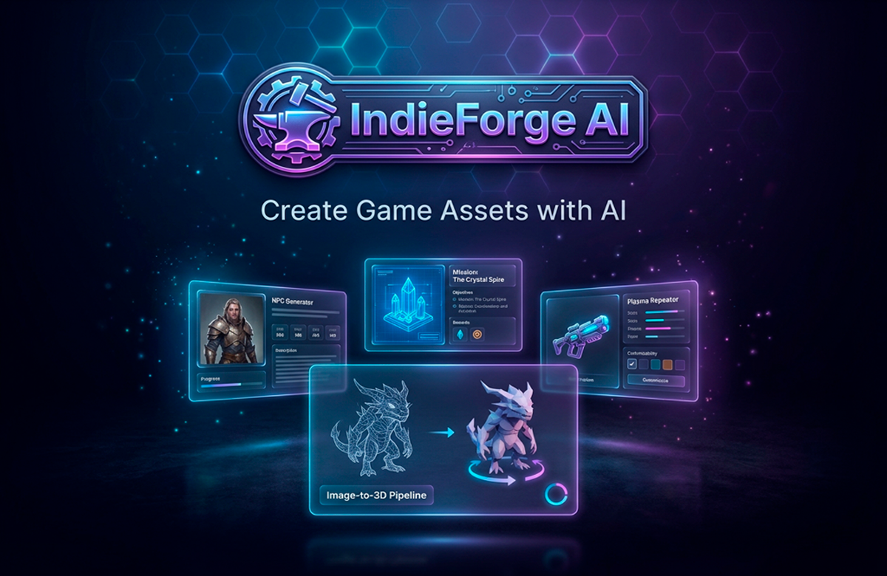
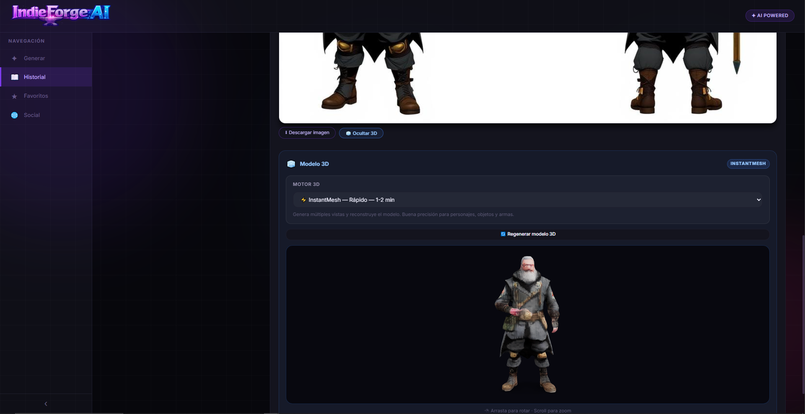

<!-- Proyecto: IndieForge AI - README profesional en español -->
# IndieForge AI — Generador Creativo de Contenido y Assets 3D



<!-- Badges -->


---

**Descripción breve**
- IndieForge AI es una plataforma full‑stack para generar contenido de juego (texto, imágenes) y transformar hojas de diseño en modelos 3D listos para integrar en pipelines de juego (.glb/.obj). Está diseñada para prototipado rápido, colaboración y publicación de assets.

**Contenido del README**
- Resumen y objetivos
- Badges y recursos visuales
- Modelos IA disponibles (LLM & multimodal)
- Pipeline Image → 3D y modelos incorporados
- Cómo ejecutar (desarrollo y despliegue)
- Endpoints principales y recomendaciones de producción

---

## Visión y objetivos
- Producir assets reutilizables (JSON + media) para motores de juego.
- Permitir a diseñadores convertir hojas 2D en modelos 3D mediante pipelines automáticos.
- Ofrecer una experiencia colaborativa con feed social y publicaciones de assets.

---

## Stack y tecnologías
- Backend: Bun (TypeScript)
- Frontend: Next.js + React + TypeScript
- Base de datos: PostgreSQL
- IA: Hugging Face Spaces, Groq, Shap‑E, Trellis2, ImagenGen
- Visual: `<model-viewer>` para inspección 3D
- Docker / Docker Compose para despliegues locales


## Recursos visuales
- Hoja de diseño de personaje: 
- Creación de modelos 3D: 

---

## Modelos LLM disponibles (detallado)
Presentamos varios modelos LLM integrados — desde tu modelo personalizado hasta modelos de gran escala. Selecciona según latencia, coste y alcance:

- **Qwen3-0.6B Heretic (Dhren Model)** — Este es mi modelo fine‑tuned (0.6B parámetros) y no tiene censura.
  - Lo afiné para adaptar el tono, la estructura de salida y el manejo de prompts de personaje.
  - Uso ideal: generar texto estructurado y plantillas JSON (NPC, diálogos, descripciones, stats).
  - Ventajas: baja latencia, coste eficiente y control fino del estilo.
  - Nota importante: al no tener censura, recomiendo implementar moderación y validaciones en el backend antes de exponerlo a usuarios públicos.

- **Llama 3.3** — Modelo de alta calidad para tareas creativas y contextos extensos.
- **Llama 3.1** — Opción alternativa con buen balance calidad/velocidad.
- **Mixtral 8x7B** — Potente para generación coherente en escenarios largos.
- **Gemma 2 (9B)** — Excelente para instrucciones y completions detalladas.
- **QwQ 32B** — Modelo de alta capacidad para tareas críticas que requieren mayor contexto.

Cada modelo puede configurarse en la app (selector de modelo) y se recomienda elegir por costo/latencia y por la complejidad de la tarea.

---

## Pipelines Image → 3D (modelos incorporados)
La app soporta tres motores / pipelines para convertir imágenes y vistas en modelos 3D:

- **Shap‑E**
  - Rápido, ideal para prototipos y previews.
  - Produce resultados en formatos comunes (.glb/.obj) con calidad suficiente para pruebas.

- **Trellis2 (trellis2)**
  - Reconstrucción de mayor fidelidad, recomendado para assets finales.
  - Requiere más recursos (GPU) y puede tener costes asociados en Spaces o infra propia.

- **ImagenGen / imagegen**
  - Pipeline híbrido que mejora texturización y generación de vistas multi‑ángulo antes de la reconstrucción.
  - Buena opción cuando se parte de ilustraciones o hojas de diseño detalladas.

En la UI el usuario puede elegir el motor (rápido → Shap‑E, calidad → Trellis2, texturizado → ImagenGen). El backend coordina la cola de trabajos y guarda `glb_url` en la entidad de generación.

---

## Funcionamiento (resumen técnico)
1. Generación: `POST /api/generate` — recibe prompt + metadatos → ejecuta LLM seleccionado (ej. Qwen3-0.6B) → devuelve JSON estructurado.
2. Imagen: el usuario sube o genera imágenes (HF/Groq) — `PATCH /api/generations/:id/image` guarda `image_url`.
3. 3D: llamada a `/api/shap-e`, `/api/trellis` o `/api/imagegen` según selección → pipeline genera `.glb`/`.obj` → `PATCH /api/generations/:id/glb` guarda `glb_url`.
4. Visualización: `PublishModal` + `<model-viewer>` permiten inspeccionar y descargar el asset.

---

## Endpoints clave (rápido)
- `POST /api/generate` — prompt → generación (JSON)
- `PATCH /api/generations/:id/image` — guardar `image_url`
- `PATCH /api/generations/:id/glb` — guardar `glb_url`
- `POST /api/shap-e`, `POST /api/trellis`, `POST /api/imagegen` — reconstrucción 3D
- `POST /api/social/posts` — crear post con `image_url` y `glb_url`

---

## Desarrollo local
1. Instalar dependencias:

```bash
bun install
```

2. Copiar `.env` de ejemplo y completar variables (HF_TOKEN, URLs de modelos, DB):

```bash
cp .env.example .env
# Rellenar HF_TOKEN, HF_SPACES_URL, etc.
```

3. Migraciones (usa el script en `src/db/migrate.ts`):

```bash
bun run src/db/migrate.ts
```

4. Ejecutar backend (desarrollo):

```bash
bun run dev
```

5. Ejecutar frontend (según scripts del proyecto):

```bash
bun run build
# o bun run dev-frontend (si existe)
```

---

## Recomendaciones de despliegue y seguridad
- Aplicar límites de tasa y caching en llamadas a HF Spaces.
- Monitorizar costes de Trellis2 y agrupar trabajos para optimizar GPU.
- Añadir moderación automatizada y filtros si expones modelos uncensored.
- En producción, usar Postgres detrás de migraciones y backups regulares.

---

**Archivos de interés**: [src/server.ts](src/server.ts), [src/routes/generate.ts](src/routes/generate.ts), [frontend/components/results/Model3DPreview.tsx](frontend/components/results/Model3DPreview.tsx)

---

## 🌍 World Creator — Mapa del Mundo 3D Procedural

### Cómo funciona

1. Accede a la sección **World Creator** en el menú lateral
2. Escribe una descripción libre de tu mundo en el cuadro de texto
3. La IA (Groq) analiza tu prompt y genera:
   - Una **descripción vívida** del mundo (lore, clima, peligros, magia)
   - Los **parámetros de terreno**: bioma, rugosidad, nivel de agua, altura de montañas, peligro, misticismo, colores, semillas procedurales, densidad de vegetación y estilo de asentamiento
4. Se renderiza un **mapa 3D WebGL interactivo** directamente en el navegador

### El efecto "wow"

- **Terreno procedural único** — fBm con 6 octavas de Simplex Noise, semillas generadas por IA para cada mundo
- **5 zonas de color por altura** — aguas profundas → playa → vegetación → alturas → nieve/roca
- **Agua animada** — desplazamiento de vértices con ondas sinusoidales y efecto de transparencia
- **Árboles procedurales** — InstancedMesh (cono + cilindro), densidad y color según el bioma: bosque, llanuras, pantano, místico
- **Asentamientos generados** — aldeas con casas y tejados cónicos / fortalezas con torres y almenas / ruinas / torres oscuras, colocados en terreno habitable
- **Partículas místicas** — nube de partículas flotantes para mundos con alta magia
- **Iluminación dinámica** — sol coloreado según peligro (cálido → rojo sangre), niebla atmosférica, luz ambiental hemisférica
- **Controles OrbitControls + WASD** — orbitar (clic + arrastrar), zoom (scroll), explorar a pie (W/A/S/D o flechas)
- **Modo pantalla completa** — botón para abrir el mapa en pantalla completa con la API nativa del navegador
- **HUD flotante** — nombre de región, bioma, nivel de peligro y misticismo superpuestos sobre el mapa

### Navegación del mapa

| Acción | Control |
|---|---|
| Orbitar / rotar | Clic izquierdo + arrastrar |
| Zoom | Rueda del ratón |
| Paneo | Clic derecho + arrastrar |
| Explorar a pie | Botón "🚶 Explorar" → W / A / S / D |
| Pantalla completa | Botón ⛶ (esquina inferior derecha) |

### Stack (100% open source / gratuito)

| Tecnología | Uso |
|---|---|
| **Three.js** | Renderizado WebGL 3D en el navegador |
| **simplex-noise** | Generación procedural de terreno (fBm) |
| **Groq API** | Extracción de parámetros + descripción del mundo |

### Archivos clave

| Archivo | Descripción |
|---|---|
| [src/routes/worldmap.ts](src/routes/worldmap.ts) | Endpoint `POST /api/worldmap` — acepta prompt libre o contenido RPG |
| [frontend/components/results/WorldMap3D.tsx](frontend/components/results/WorldMap3D.tsx) | Motor Three.js: terreno, agua, árboles, edificios, WASD |
| [frontend/pages/WorldCreatorPage.tsx](frontend/pages/WorldCreatorPage.tsx) | Página World Creator con textarea + descripción IA + mapa |

---
