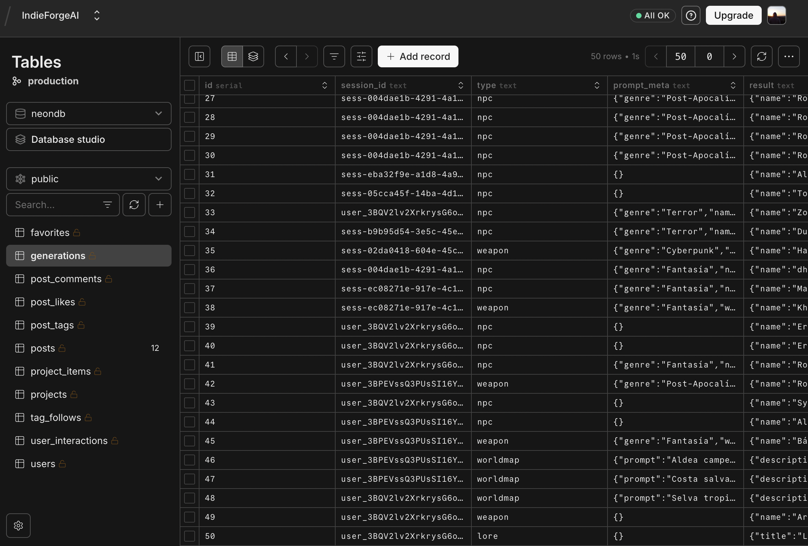

<!-- Proyecto: IndieForge AI - README profesional en español -->
# IndieForge AI — Generador Creativo de Contenido y Assets 3D


<!-- Badges -->


---

**Descripción breve**
- IndieForge AI es una plataforma full‑stack para generar contenido de juego (texto, imágenes) y transformar hojas de diseño en modelos 3D listos para integrar en pipelines de juego (.glb/.obj). Está diseñada para prototipado rápido, colaboración y publicación de assets.

**Contenido del README**
- [Visión y objetivos](#visión-y-objetivos)
- [Stack y tecnologías](#stack-y-tecnologías)
- [Modelos LLM disponibles](#modelos-llm-disponibles-detallado)
- [Pipeline Image → 3D](#pipelines-image--3d-modelos-incorporados)
- [Point Cloud Loader — Animación mientras se crea el mundo](#-point-cloud-loader--animación-de-terreno-procedural)
- [Export Pack — Descarga de proyectos en ZIP](#-export-pack--descarga-de-proyectos-en-zip)
- [Base de datos](#-base-de-datos)
- [Social — Algoritmo ML de recomendación](#-social--algoritmo-de-machine-learning-para-el-feed)
- [Fusión Forge — Combinación arcana de creaciones](#-fusión-forge--combinación-arcana-de-creaciones)
- [World Creator](#-world-creator--mapa-del-mundo-3d-procedural)
- [Desarrollo local](#desarrollo-local)
- [Endpoints clave](#endpoints-clave-rápido)

---

## Visión y objetivos
- Producir assets reutilizables (JSON + media) para motores de juego.
- Permitir a diseñadores convertir hojas 2D en modelos 3D mediante pipelines automáticos.
- Ofrecer una experiencia colaborativa con feed social y publicaciones de assets.

---

## Stack y tecnologías
| Tecnología | Uso |
|---|---|
| **Bun** | Runtime + bundler + servidor HTTP (TypeScript) |
| **React 18** | Frontend SPA con hooks y estado global |
| **Three.js** | Renderizado WebGL 3D (mundo procedural, point cloud, model-viewer) |
| **simplex-noise** | Generación fBm de terreno procedural |
| **PostgreSQL** | Base de datos relacional (generaciones, posts, interacciones) |
| **Clerk** | Autenticación (JWT + cookies, login social) |
| **Groq API** | LLM principal para generación de texto (Llama, Mixtral, etc.) |
| **HuggingFace** | Generación de imágenes (FLUX.1-schnell) + modelo fine-tuned Qwen3 |
| **Shap-E / Trellis2** | Pipelines de reconstrucción Image → 3D |
| **JSZip** | Generación de archivos ZIP para Export Pack |
| **Docker / Docker Compose** | Despliegue contenedorizado |


## Recursos visuales
- Hoja de diseño de personaje: 
- Creación de modelos 3D: 

---

## Modelos LLM disponibles (detallado)
Presentamos varios modelos LLM integrados — desde tu modelo personalizado hasta modelos de gran escala. Selecciona según latencia, coste y alcance:

- **Qwen3-0.6B Heretic (Dhren Model)** — Este es mi modelo fine‑tuned (0.6B parámetros) y no tiene censura.
  - Lo afiné para adaptar el tono, la estructura de salida y el manejo de prompts de personaje.
  - Uso ideal: generar texto estructurado y plantillas JSON (NPC, diálogos, descripciones, stats).
  - Ventajas: baja latencia, coste eficiente y control fino del estilo.
  - Nota importante: al no tener censura, recomiendo implementar moderación y validaciones en el backend antes de exponerlo a usuarios públicos.

- **Llama 3.3** — Modelo de alta calidad para tareas creativas y contextos extensos.
- **Llama 3.1** — Opción alternativa con buen balance calidad/velocidad.
- **Mixtral 8x7B** — Potente para generación coherente en escenarios largos.
- **Gemma 2 (9B)** — Excelente para instrucciones y completions detalladas.
- **QwQ 32B** — Modelo de alta capacidad para tareas críticas que requieren mayor contexto.

Cada modelo puede configurarse en la app (selector de modelo) y se recomienda elegir por costo/latencia y por la complejidad de la tarea.

---

## Pipelines Image → 3D (modelos incorporados)
La app soporta tres motores / pipelines para convertir imágenes y vistas en modelos 3D:

- **Shap‑E**
  - Rápido, ideal para prototipos y previews.
  - Produce resultados en formatos comunes (.glb/.obj) con calidad suficiente para pruebas.

- **Trellis2 (trellis2)**
  - Reconstrucción de mayor fidelidad, recomendado para assets finales.
  - Requiere más recursos (GPU) y puede tener costes asociados en Spaces o infra propia.

- **ImagenGen / imagegen**
  - Pipeline híbrido que mejora texturización y generación de vistas multi‑ángulo antes de la reconstrucción.
  - Buena opción cuando se parte de ilustraciones o hojas de diseño detalladas.

En la UI el usuario puede elegir el motor (rápido → Shap‑E, calidad → Trellis2, texturizado → ImagenGen). El backend coordina la cola de trabajos y guarda `glb_url` en la entidad de generación.

---

## 🏔️ Point Cloud Loader — Animación de terreno procedural

Mientras la IA genera el mundo (texto + parámetros de terreno) y mientras Three.js inicializa la escena 3D o carga los assets glTF, en lugar de mostrar una pantalla negra o un spinner genérico, se renderiza un **mapa de terreno animado en nube de puntos** que da la sensación de que el mundo se está "formando" en tiempo real.

### Cómo funciona

1. Se crea una cuadrícula de **120 × 120 puntos** (14 400 puntos) en un plano XZ
2. La altura de cada punto se calcula con **fBm (Fractional Brownian Motion)** de 6 octavas usando `simplex-noise`
3. El color se asigna por altitud, imitando la paleta del mapa real:
   - 🌊 **Agua profunda** (azul oscuro) → **Agua somera** (azul medio)
   - 🏖️ **Playa / arena** (ocre)
   - 🌿 **Vegetación baja** (verde) → **Altiplano** (marrón)
   - 🪨 **Roca** (gris) → ❄️ **Nieve** (blanco)
4. Se añaden **3 000 puntos de agua** a la altura del nivel del mar con efecto shimmer (opacidad sinusoidal)
5. **800 estrellas de fondo** para dar contexto espacial
6. La cámara **orbita lentamente** alrededor del terreno con movimiento vertical suave
7. Un `ResizeObserver` mantiene el canvas **a ancho completo del contenedor** del mapa

### Dónde aparece

| Momento | Componente | Descripción |
|---|---|---|
| Generación IA activa | `WorldCreatorPage.tsx` | Mientras Groq procesa el prompt y genera lore + parámetros |
| Inicialización 3D | `WorldMap3D.tsx` (overlay) | Mientras Three.js construye la escena y/o carga glTFs |

### Archivos clave

| Archivo | Descripción |
|---|---|
| `frontend/components/ui/PointCloudLoader.tsx` | Componente React + Three.js con terreno procedural |
| `frontend/styles/components.css` | Clases `.wc-pointcloud*` y `.wc-map-loader-overlay` |

---

## 📦 Export Pack — Descarga de proyectos en ZIP

Los usuarios pueden descargar todo un proyecto como un **"Export Pack"** — un archivo ZIP listo para importar en motores de juego (Unity, Godot, etc.).

### Contenido del ZIP

```
📦 mi-proyecto_export.zip
├── game-bible.json          ← Datos estructurados de cada generación
├── game-bible.md            ← Resumen legible en Markdown
├── unity-data.json          ← Array plano optimizado para Unity (C# deserializable)
├── godot-data.json          ← Array plano optimizado para Godot (GDScript parseable)
└── assets/
    ├── images/              ← PNGs/JPGs de cada generación (decodificados de base64)
    │   ├── 001_Aldric.png
    │   ├── 002_Espada_Flamigera.png
    │   └── ...
    └── models/              ← Modelos .glb de cada generación
        ├── 001_Aldric.glb
        ├── 002_Espada_Flamigera.glb
        └── ...
```

### `game-bible.json`

Contiene el objeto completo del proyecto con todos los metadatos:

```json
{
  "project": "Mi RPG Medieval",
  "exported": "2026-03-30T12:00:00.000Z",
  "item_count": 15,
  "items": [
    {
      "id": 42,
      "type": "npc",
      "prompt_meta": { "genre": "medieval", "role": "merchant" },
      "result": { "name": "Aldric", "class": "Mercader", "stats": { ... } },
      "image_url": "assets/images/001_Aldric.png",
      "glb_url": "assets/models/001_Aldric.glb",
      "created_at": "2026-03-28T10:30:00Z"
    }
  ]
}
```

### `game-bible.md`

Documento Markdown con el lore completo del proyecto, incluyendo estadísticas, descripciones y enlaces relativos a las imágenes y modelos.

### `unity-data.json` / `godot-data.json`

Arrays planos con rutas relativas a los assets, listos para deserializar en los respectivos motores:

```json
{
  "items": [
    {
      "id": 42,
      "type": "npc",
      "slug": "001_Aldric",
      "data": { "name": "Aldric", ... },
      "image": "assets/images/001_Aldric.png",
      "model": "assets/models/001_Aldric.glb"
    }
  ]
}
```

### Cómo usarlo

1. Abre la sección **Proyectos** y selecciona un proyecto
2. Haz clic en el botón **📦 Export Pack** en la cabecera del proyecto
3. Se genera el ZIP en el servidor y se descarga automáticamente

### Endpoint

```
GET /api/projects/:id/export
```

Requiere autenticación (Clerk cookies). Devuelve `Content-Type: application/zip`.

### Archivos clave

| Archivo | Descripción |
|---|---|
| `src/routes/project-export.ts` | Lógica de generación del ZIP con JSZip |
| `src/routes/projects.ts` | Enrutamiento — redirige `/export` al handler |
| `frontend/pages/ProjectsPage.tsx` | Botón "Export Pack" en el header del detalle |

---

## 🗄️ Base de datos

La base de datos es **PostgreSQL** y se migra automáticamente al arrancar el servidor (`src/db/schema.sql`). El esquema soporta todo el ciclo de vida: generación → organización → publicación → interacción social.

### Diagrama ER



### Tablas principales

| Tabla | Propósito | Relaciones clave |
|---|---|---|
| **`users`** | Usuarios registrados (Clerk) y anónimos (cookie) | `session_id` como identificador universal |
| **`generations`** | Cada generación de contenido (NPC, quest, item, weapon, enemy, lore) | Contiene `prompt_meta` (JSON), `result` (JSON), `image_url`, `glb_url` |
| **`favorites`** | Marcadores de favoritos del usuario | FK → `generations(id)`, UNIQUE(`session_id`, `generation_id`) |
| **`projects`** | Carpetas/proyectos para organizar generaciones | Propiedad por `session_id` |
| **`project_items`** | Relación N:M entre proyectos y generaciones | PK compuesta (`project_id`, `generation_id`) |
| **`posts`** | Publicaciones sociales con título, descripción, tipo y assets | FK opcional → `generations(id)` |
| **`post_tags`** | Etiquetas de cada publicación | PK compuesta (`post_id`, `tag`) |
| **`tag_follows`** | Etiquetas que sigue cada usuario | PK compuesta (`session_id`, `tag`) |
| **`post_likes`** | Likes de usuarios a publicaciones | PK compuesta (`session_id`, `post_id`) |
| **`post_comments`** | Comentarios en publicaciones (máx. 300 chars) | FK → `posts(id)` |
| **`user_interactions`** | Señales de comportamiento para el algoritmo ML | Tipos: `view`, `expand`, `like`, `comment` |

### Índices de rendimiento

```sql
-- Generaciones
CREATE INDEX idx_generations_session ON generations(session_id);
CREATE INDEX idx_generations_type    ON generations(type);

-- Posts sociales
CREATE INDEX idx_posts_session  ON posts(session_id);
CREATE INDEX idx_posts_type     ON posts(type);
CREATE INDEX idx_posts_created  ON posts(created_at);

-- Interacciones ML (críticos para el feed de recomendación)
CREATE INDEX idx_ui_session        ON user_interactions(session_id);
CREATE INDEX idx_ui_post           ON user_interactions(post_id);
CREATE INDEX idx_ui_session_post   ON user_interactions(session_id, post_id);
CREATE INDEX idx_ui_session_action ON user_interactions(session_id, action);
```

### Migración de sesiones anónimas → Clerk

Cuando un usuario anónimo (cookie) inicia sesión con Clerk por primera vez, se ejecuta una migración que transfiere **todas** sus generaciones, favoritos, proyectos, posts, likes, comentarios, follows e interacciones al nuevo `session_id` de Clerk. Esto garantiza que no se pierde ningún dato.

---

## 🧠 Social — Algoritmo de Machine Learning para el Feed

El feed social de IndieForge AI no muestra los posts por orden cronológico simple. Implementa un **algoritmo de recomendación basado en 6 señales ponderadas** que personaliza el contenido para cada usuario según sus interacciones históricas.

### Señales del algoritmo

El score final de cada post se calcula como la **suma ponderada** de estas señales:

| Señal | Peso | Descripción | Ventana temporal |
|---|---|---|---|
| **S1 — Etiquetas seguidas** | `×5.0` | Si el post tiene etiquetas que el usuario sigue directamente | Sin límite |
| **S2 — Afinidad por tipo** | `×0.5 × Σ(action_weight)` | Pondera las interacciones previas del usuario con posts del mismo tipo (NPC, weapon, etc.) | 45 días |
| **S3 — Afinidad por etiqueta** | `×2.0` | Cuenta cuántas veces el usuario interactuó con posts que comparten etiquetas con el post candidato | 30 días |
| **S4 — Filtrado colaborativo** | `×3.5` | Cuántos usuarios con gustos similares (que dieron like a los mismos posts que tú) también dieron like a este post | Sin límite |
| **S5 — Popularidad** | `×0.4` | Total de likes del post (señal débil para evitar sesgo de popularidad) | Sin límite |
| **S6 — Recencia** | `×4.0 × e^(-d/3)` | Decaimiento exponencial — los posts recientes tienen más peso (vida media ≈ 3 días) | Exponencial |
| **P — Penalización visto** | `-1.5 × views` | Penaliza posts que el usuario ya vio recientemente | 24 horas |

### Pesos de interacción (S2)

Cada tipo de interacción tiene un peso diferente para calcular la afinidad:

| Acción | Peso | Significado |
|---|---|---|
| `like` | 3.0 | Señal fuerte de interés |
| `comment` | 2.5 | Engagement activo |
| `expand` | 1.0 | Curiosidad / lectura detallada |
| `view` | 0.1 | Señal pasiva (bajo peso, alto volumen) |

### Filtrado colaborativo (S4)

```
Para cada post candidato P:
  1. Encuentra usuarios U_similar = {usuarios que dieron like a posts que TÚ también likeastes}
  2. Cuenta cuántos de U_similar también dieron like a P
  3. Score_S4 = count(U_similar que likearon P) × 3.5
```

Este mecanismo detecta "tribus" de usuarios con gustos similares sin necesidad de datos demográficos explícitos.

### Decaimiento temporal (S6)

La recencia usa un **decaimiento exponencial** con vida media de ~3 días:

```
Score_S6 = 4.0 × e^(−days_since_creation / 3.0)
```

| Edad del post | Score S6 |
|---|---|
| 0 días (recién creado) | 4.00 |
| 1 día | 2.87 |
| 3 días | 1.47 |
| 7 días | 0.39 |
| 14 días | 0.04 |

### Deduplicación de vistas

Las interacciones de tipo `view` se deduplicane por sesión + post en ventanas de 30 minutos para evitar inflar el contador de vistas con recargas de página.

### Captura de señales en el frontend

El frontend envía automáticamente señales de interacción:

```typescript
// Al hacer scroll y el post entra en viewport → "view"
apiRecordInteraction(post.id, "view");

// Al expandir el detalle de un post → "expand"
apiRecordInteraction(post.id, "expand");

// Like y comment se registran automáticamente en el handler del backend
```

### Trending (algoritmo separado)

El tab "Trending" usa un algoritmo más simple basado en **actividad en las últimas 48 horas**:

```
Score_trending = likes_48h × 3 + comments_48h × 2 + interactions_48h × 1
```

Solo muestra posts de los últimos 7 días.

### Exclusiones

- Los posts del propio usuario **nunca** aparecen en su feed
- Los posts ya likeados se **excluyen** (ya los conoces)
- Posts vistos recientemente se **penalizan** pero no se excluyen (pueden subir si reciben likes)

### Archivos clave

| Archivo | Descripción |
|---|---|
| `src/db/client.ts` → `getFeed()` | Query SQL con las 6 señales como subqueries correlacionadas |
| `src/db/client.ts` → `recordInteraction()` | Registro de señales con deduplicación de views |
| `src/db/client.ts` → `getTrendingPosts()` | Algoritmo de trending (48h) |
| `src/routes/social.ts` | Endpoints REST para feed, trending, interactions |
| `frontend/hooks/useSocialFeed.ts` | Hook React que gestiona tabs (feed/trending/explorar) |
| `frontend/components/social/FeedPost.tsx` | Envía señales view/expand al backend via IntersectionObserver |

---

## 🔥 Fusión Forge — Combinación arcana de creaciones

Fusion Forge permite al usuario **seleccionar dos creaciones existentes** de su historial (NPCs, armas, enemigos, objetos, misiones…) y fusionarlas mediante IA en un **híbrido único** con rasgos, habilidades y lore combinados.

### Flujo de uso

1. Selecciona dos creaciones del historial en los **slots A y B**
2. Elige el modelo LLM con el que quieres forjar
3. Pulsa **FORJAR FUSIÓN** para iniciar el proceso
4. Se muestra una **animación de invocación arcana** (runas Futhark giratorias, partículas de energía, destello de revelación) mientras la IA procesa la fusión
5. Al completarse, la animación ejecuta un **flash de revelación** y da paso a la creación fusionada

### Qué genera la IA

- Combina el **lore y trasfondo** de ambas fuentes en una narrativa coherente
- Fusiona **estadísticas y habilidades** en valores equilibrados
- Genera un **nombre y descripción únicos** para el híbrido
- Mantiene metadatos de trazabilidad: `_fusion: true`, `_source_a`, `_source_b`

### Animación de invocación arcana

Antes de revelar el resultado, se muestra una secuencia de animación estilo RPG/gacha compuesta de:

| Elemento | Descripción |
|---|---|
| **Círculos concéntricos** | Tres anillos pulsantes con el color del tipo de creación |
| **Runas nórdicas (Futhark)** | Dos anillos girando en sentidos opuestos (18 runas ext. / 12 int.) |
| **6 líneas radiales** | Crosshair tipo pentáculo que rota lentamente |
| **Hexágono central** | Emblema del sello giratorio |
| **Partículas de energía** | Flotan hacia arriba desde el borde del círculo |
| **Reveal flash** | Al completarse, brillo ×3 + scale(1.15) + fade out de 0.9 s |

### Colores por tipo de creación

| Tipo | Color |
|---|---|
| NPC | `#a855f7` (púrpura) |
| Quest | `#3b82f6` (azul) |
| Item | `#f59e0b` (ámbar) |
| Lore | `#10b981` (esmeralda) |
| Weapon | `#ef4444` (rojo) |
| Enemy | `#dc2626` (carmesí) |

### Implementación técnica

- Canvas 2D con `requestAnimationFrame` (sin Three.js — ligero)
- `ResizeObserver` para responsividad automática
- Sistema de partículas con pool y reciclaje de ciclo de vida
- Transición de fases: `idle → summoning → reveal → done → idle`
- El resultado solo se muestra después de que el callback `onRevealDone` confirma el fin del flash

### Archivos clave

| Archivo | Descripción |
|---|---|
| `frontend/pages/ForgePage.tsx` | Página principal: slots de selección, botón de forja, flujo de estados |
| `frontend/components/ui/ForgeAnimation.tsx` | Animación inicial de forja (círculos de los tipos A y B) |
| `frontend/components/ui/SummonCircle.tsx` | Animación de invocación arcana: runas, partículas y reveal flash |
| `frontend/components/results/ForgeResultDisplay.tsx` | Tarjeta del resultado fusionado con acciones (favorito, proyecto, compartir) |
| `src/routes/forge.ts` | Endpoint `POST /api/forge` — recibe IDs de A y B, construye el prompt y llama al LLM |

---

## Funcionamiento (resumen técnico)
1. Generación: `POST /api/generate` — recibe prompt + metadatos → ejecuta LLM seleccionado (ej. Qwen3-0.6B) → devuelve JSON estructurado.
2. Imagen: el usuario sube o genera imágenes (HF/Groq) — `PATCH /api/generations/:id/image` guarda `image_url`.
3. 3D: llamada a `/api/shap-e`, `/api/trellis` o `/api/imagegen` según selección → pipeline genera `.glb`/`.obj` → `PATCH /api/generations/:id/glb` guarda `glb_url`.
4. Visualización: `PublishModal` + `<model-viewer>` permiten inspeccionar y descargar el asset.

---

## Endpoints clave (rápido)
- `POST /api/generate` — prompt → generación (JSON)
- `PATCH /api/generations/:id/image` — guardar `image_url`
- `PATCH /api/generations/:id/glb` — guardar `glb_url`
- `POST /api/shap-e`, `POST /api/trellis`, `POST /api/imagegen` — reconstrucción 3D
- `POST /api/social/posts` — crear post con `image_url` y `glb_url`
- `GET /api/social/feed` — feed personalizado con algoritmo ML
- `POST /api/social/interactions` — registrar señal de interacción (view/expand/like/comment)
- `GET /api/projects/:id/export` — descargar Export Pack (ZIP)

---

## Desarrollo local
1. Instalar dependencias:

```bash
bun install
```

2. Copiar `.env` de ejemplo y completar variables (HF_TOKEN, URLs de modelos, DB):

```bash
cp .env.example .env
# Rellenar HF_TOKEN, HF_SPACES_URL, etc.
```

3. Migraciones (usa el script en `src/db/migrate.ts`):

```bash
bun run src/db/migrate.ts
```

4. Ejecutar backend (desarrollo):

```bash
bun run dev
```

5. Ejecutar frontend (según scripts del proyecto):

```bash
bun run build
# o bun run dev-frontend (si existe)
```

---

## Recomendaciones de despliegue y seguridad
- Aplicar límites de tasa y caching en llamadas a HF Spaces.
- Monitorizar costes de Trellis2 y agrupar trabajos para optimizar GPU.
- Añadir moderación automatizada y filtros si expones modelos uncensored.
- En producción, usar Postgres detrás de migraciones y backups regulares.

---

**Archivos de interés**: [src/server.ts](src/server.ts), [src/routes/generate.ts](src/routes/generate.ts), [frontend/components/results/Model3DPreview.tsx](frontend/components/results/Model3DPreview.tsx)

---

## 🌍 World Creator — Mapa del Mundo 3D Procedural

### Cómo funciona

1. Accede a la sección **World Creator** en el menú lateral
2. Escribe una descripción libre de tu mundo en el cuadro de texto
3. La IA (Groq) analiza tu prompt y genera:
   - Una **descripción vívida** del mundo (lore, clima, peligros, magia)
   - Los **parámetros de terreno**: bioma, rugosidad, nivel de agua, altura de montañas, peligro, misticismo, colores, semillas procedurales, densidad de vegetación y estilo de asentamiento
4. Se renderiza un **mapa 3D WebGL interactivo** directamente en el navegador

### Características visuales del terreno

- **Terreno procedural único** — fBm con 6 octavas de Simplex Noise, semillas generadas por IA para cada mundo
- **5 zonas de color por altura** — aguas profundas → playa → vegetación → alturas → nieve/roca
- **Agua animada** — desplazamiento de vértices con ondas sinusoidales y efecto de transparencia
- **Árboles procedurales** — InstancedMesh (cono + cilindro), densidad y color según el bioma: bosque, llanuras, pantano, místico
- **Asentamientos generados** — aldeas con casas y tejados cónicos / fortalezas con torres y almenas / ruinas / torres oscuras, colocados en terreno habitable
- **Partículas místicas** — nube de partículas flotantes para mundos con alta magia
- **Iluminación dinámica** — sol coloreado según peligro (cálido → rojo sangre), niebla atmosférica, luz ambiental hemisférica
- **Controles OrbitControls + WASD** — orbitar (clic + arrastrar), zoom (scroll), explorar a pie (W/A/S/D o flechas)
- **Modo pantalla completa** — botón para abrir el mapa en pantalla completa con la API nativa del navegador
- **HUD flotante** — nombre de región, bioma, nivel de peligro y misticismo superpuestos sobre el mapa

### Navegación del mapa

| Acción | Control |
|---|---|
| Orbitar / rotar | Clic izquierdo + arrastrar |
| Zoom | Rueda del ratón |
| Paneo | Clic derecho + arrastrar |
| Explorar a pie | Botón "🚶 Explorar" → W / A / S / D |
| Pantalla completa | Botón ⛶ (esquina inferior derecha) |

### Stack (100% open source / gratuito)

| Tecnología | Uso |
|---|---|
| **Three.js** | Renderizado WebGL 3D en el navegador |
| **simplex-noise** | Generación procedural de terreno (fBm) |
| **Groq API** | Extracción de parámetros + descripción del mundo |

### Assets glTF reales de videojuegos

Al activar el modo **"Usar glTF reales"**, World Creator carga modelos y assets 3D extraídos directamente de videojuegos en formato `.glTF`/`.glb`:

- Los modelos se instancian sobre el terreno procedural: personajes, enemigos, objetos de escenario y props de ambiente se colocan según el bioma y los parámetros generados.
- Los assets se cargan mediante **`THREE.GLTFLoader`**, por lo que cualquier modelo `.glb` compatible con el estándar Khronos puede ser usado.
- **Skeleton / esqueleto**: durante la carga de cada modelo se muestra un esqueleto animado (skeleton placeholder) que indica visualmente el progreso, exactamente igual al skeleton loading de la UI general. Una vez cargado el asset, el placeholder desaparece y aparece el modelo real.
- Los modelos incluyen sus propias animaciones (idle, walk, attack) si las `.glb` las traen embebidas, activadas automáticamente con `AnimationMixer`.

### Modo primera persona

Pulsa el botón **"🎮 Primera persona"** para entrar en modo FPS dentro del propio mundo generado:

- El cursor queda capturado en el canvas (Pointer Lock API).
- Movimiento con `W / A / S / D` o flechas, vista con el ratón.
- Los modelos glTF coexisten en la escena con el terreno procedural, pudiendo explorar junto a ellos.
- Pulsa `Esc` para salir del modo FPS y volver a OrbitControls.

### Guardar en Mis Proyectos

Una vez generado un mundo (con o sin glTF reales), pulsa **"Añadir a proyecto"** para guardarlo:

- Se abre el panel `AddToProjectPanel` donde puedes asociar el mundo a un proyecto existente o crear uno nuevo.
- Los parámetros del mundo (bioma, semillas, colores, descripción IA) quedan vinculados al proyecto para poder recuperarlos y regenerarlos en cualquier momento.

### Archivos clave

| Archivo | Descripción |
|---|---|
| [src/routes/worldmap.ts](src/routes/worldmap.ts) | Endpoint `POST /api/worldmap` — acepta prompt libre o contenido RPG |
| [frontend/components/results/WorldMap3D.tsx](frontend/components/results/WorldMap3D.tsx) | Motor Three.js: terreno, agua, árboles, edificios, WASD, glTF loader, FPS |
| [frontend/pages/WorldCreatorPage.tsx](frontend/pages/WorldCreatorPage.tsx) | Página World Creator con textarea + descripción IA + mapa + proyectos |

---
