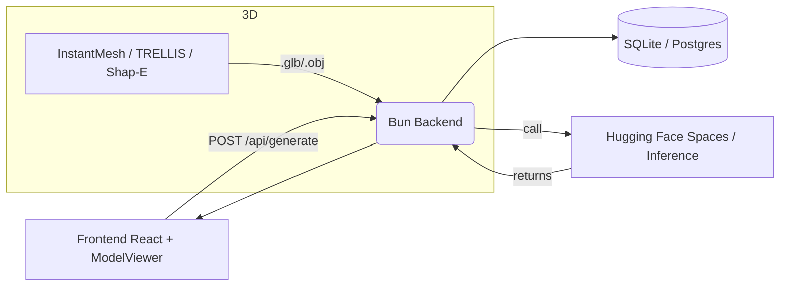

# IndieForge AI — Generador Creativo de Contenido y Assets 3D

> Plataforma para generar contenido de juego (texto, imágenes) y convertir hojas de diseño en modelos 3D interactivos. Full‑stack, pensada para prototipado rápido y compartición en comunidad.

---

**Contenido**
- Resumen
- Highlights (rápido vistazo)
- Diagrama de arquitectura
- Flujo: imagen → 3D
- Stack y tecnologías
- Modelos IA (incluye tu Qwen 0.6B fine‑tuned *uncensored*)
- Endpoints clave
- Cómo ejecutar (dev + migraciones)
- Contribuir

---

## Resumen
IndieForge AI ayuda a desarrolladores y creadores a generar contenido estructurado (NPCs, misiones, objetos, lore) y a transformar hojas de diseño 2D en modelos 3D (.glb/.obj). Está pensado para integrarse en pipelines de juegos: outputs en JSON listos para importar.

Puntos fuertes:
- Outputs como JSON validado (fácil de consumir por motores de juego).
- Pipeline de imagen → 3D con varias opciones de calidad/velocidad.
- Persistencia de imágenes y modelos 3D en la DB (`image_url`, `glb_url`).
- Feed social para publicar y compartir assets.

---

## Highlights
- Generación rápida y fiable gracias a fallback pool.
- Soporta tu modelo personalizado **Qwen 0.6B (fine‑tuned, uncensored)** para generación de texto.
- Integración con modelos gratuitos (Groq) para imágenes y con HF Spaces para reconstrucción 3D.
- Visualización 3D con `<model-viewer>` en el modal de publicación.

---

## Diagrama de alto nivel


---

## Flujo: Image → 3D (resumen visual)
1. Usuario genera o sube una hoja de diseño (frontal + trasera).
2. `Model3DPreview` recorta la mitad frontal y llama al endpoint elegido (`instant-mesh`, `trellis`, `shap-e`).
3. El Space/pipeline genera multi‑view y luego reconstruye a 3D; devuelve URL del `.glb` o `.obj`.
4. La app guarda la URL en `generations.glb_url` y muestra el asset en `PublishModal` con `<model-viewer>`.

---

## Stack y tecnologías
- Backend: Bun (TypeScript)
- Base de datos: SQLite (por defecto) — migraciones con `src/db/migrate.ts` (soporta Postgres)
- Frontend: React + TypeScript, componentes propios
- IA: Hugging Face Spaces (`@gradio/client`), Groq (imágenes), Shap-E/Trellis/InstantMesh (3D)
- Visual: `<model-viewer>` para inspección 3D
- Docker: `docker-compose` para despliegues locales

---

## Modelos IA (detalles importantes)

- Tu modelo: **Qwen 0.6B — Fine‑tuned & uncensored**
  - Uso principal: generación de texto estructurado (prompt → JSON) con estilo propio.
  - Ventajas: latencia baja, costos controlados, respuestas alineadas a tu tono.
  - Precaución: al ser "uncensored" debes añadir validaciones y moderación si el servicio se hace público.

- Modelos gratuitos y auxiliares:
  - **Groq**: opción para generación de imágenes rápida y sin coste elevado.
  - **InstantMesh** (SIGMitch): rápido, buen balance calidad/tiempo.
  - **TRELLIS.2** (Microsoft): mejor calidad, puede necesitar cuenta PRO / mayor cuota GPU.
  - **Shap‑E**: muy rápido, calidad básica — útil para pruebas.

Arquitectura recomendada: usar Qwen-finetuned para texto (prompt → JSON), Groq para imágenes y ofrecer InstantMesh/TRELLIS/Shap-E como opciones para 3D.

---

## Endpoints clave
- `POST /api/generate` — generar contenido (JSON).
- `PATCH /api/generations/:id/image` — guardar `image_url`.
- `PATCH /api/generations/:id/glb` — guardar `glb_url` (3D models).
- `POST /api/instant-mesh`, `/api/trellis`, `/api/shap-e` — reconstrucción 3D a partir de imagen.
- `POST /api/social/posts` — crear post con `image_url` y `glb_url`.

---

## Cómo ejecutar (dev)
1. Instalar dependencias:

```bash
bun install
```

2. Configurar variables (`.env`):

```bash
cp .env.example .env
# Rellenar HF_TOKEN, HF_MODEL_URL si usas Inference API
```

3. Migraciones (aplica `glb_url` si falta):

```bash
bun run src/db/migrate.ts
```

4. Ejecutar servidor (dev):

```bash
bun run dev
```

5. Ejecutar frontend (si procede):

```bash
# según el script del proyecto (por ejemplo)
bun run build
# o bun run dev-frontend
```

---

## Recomendaciones de producción
- Añadir límites de tasa y caching para llamadas a HF Spaces.
- Monitorizar coste de TRELLIS (GPU) y ofrecer alternativas por defecto.
- Implementar moderación si el modelo uncensored se expone a usuarios externos.

---

## Contribuir
- Abrir issues para mejoras o bugs.
- Pull requests: incluye tests en rutas y migraciones si modificas DB.
- Prioridad a la robustez de la persistencia (`src/db/client.ts`) y a la trazabilidad de pipelines 3D.

---

Si quieres, puedo generar también:
- Una versión en inglés.
- Un `README_DEMO.md` con capturas y GIFs (suminístrame las imágenes).
- Diagramas más detallados por subsistema (DB, backend, frontend).

Archivo actualizado: [README.md](README.md)

---

© IndieForge AI — documentación creada y organizada automáticamente. Pregunta si quieres adaptaciones visuales o versión para presentación.
